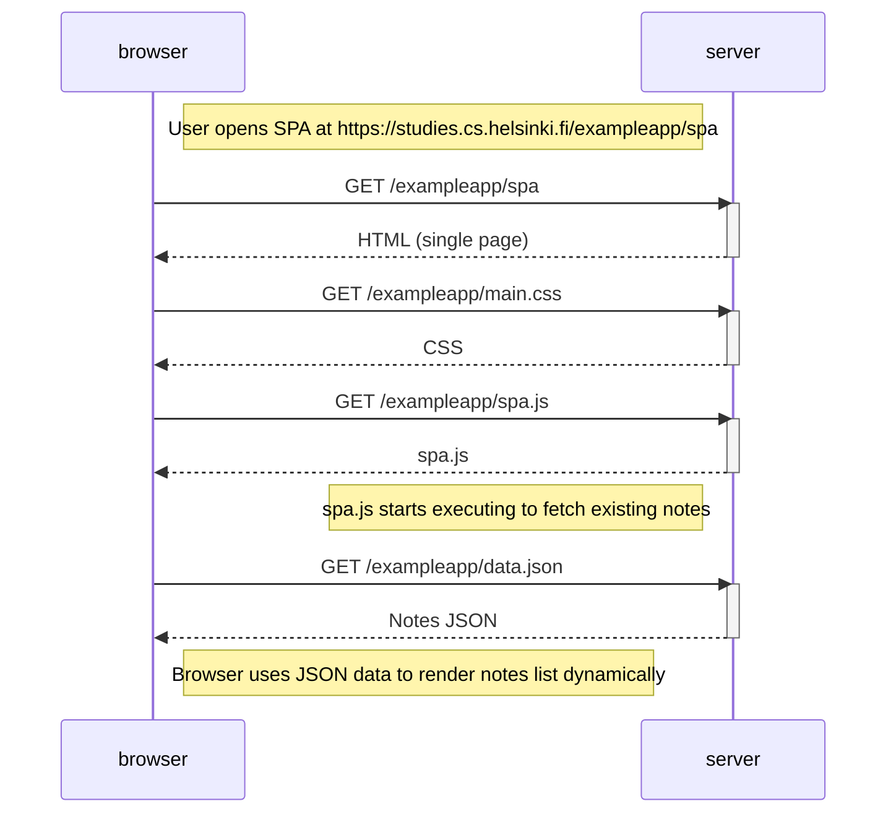

## Single page app diagram

The following exercise represents the situation where the user access [this](https://studies.cs.helsinki.fi/exampleapp/spa) single page app. The diagram was created with [Mermaid](https://en.wikipedia.org/wiki/Mermaid_(software)#:~:text=Mermaid%20is%20an%20open%2Dsource,with%20proprietary%20software%20file%20formats.) syntaxis.

1. User action (opening SPA).
2. Initial request (browser sends `GET exampleapp/spa`).
3. Server responds with the single HTML page.
4. Browser fetches `exampleapp/main.css` (styles) and `exampleapp/spa.js` (SPA logic).
5. JavaScript execution (spa.js runs in the browser).
6. Data fetch (JS code requests `exampleapp/data.json` from the server).
7. Server responds with notes JSON.
8. Browser uses the JSON data to render the notes dynamically in the DOM (without requesting extra HTML).

---

