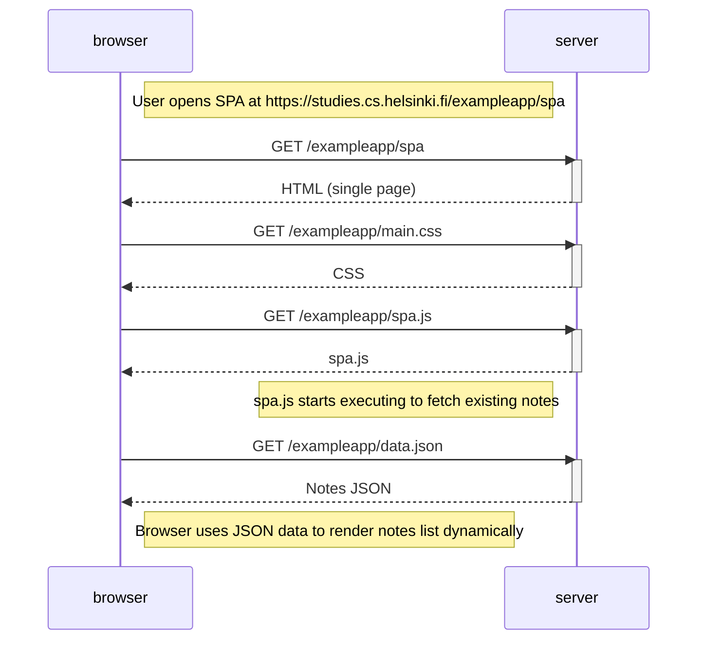

```mermaid
sequenceDiagram
    participant browser
    participant server

    Note right of browser: User opens SPA at https://studies.cs.helsinki.fi/exampleapp/spa

    browser->>server: GET /exampleapp/spa
    activate server
    server-->>browser: HTML (single page)
    deactivate server

    browser->>server: GET /exampleapp/main.css
    activate server
    server-->>browser: CSS
    deactivate server

    browser->>server: GET /exampleapp/spa.js
    activate server
    server-->>browser: spa.js
    deactivate server

    Note left of server: spa.js starts executing to fetch existing notes

    browser->>server: GET /exampleapp/data.json
    activate server
    server-->>browser: Notes JSON
    deactivate server

    Note right of browser: Browser uses JSON data to render notes list dynamically
```