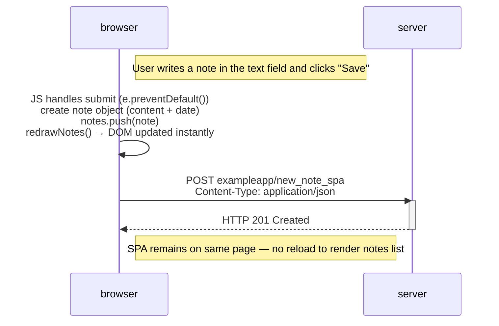

## New note in Single page app diagram

The following exercise represents the situation where the user creates a new note in the SPA https://studies.cs.helsinki.fi/exampleapp/spa. The diagram was created with [Mermaid](https://en.wikipedia.org/wiki/Mermaid_(software)#:~:text=Mermaid%20is%20an%20open%2Dsource,with%20proprietary%20software%20file%20formats.) syntaxis

1. User action (writing note + clicking save).
2. JavaScript handles submit. The onsubmit handler runs:
- `.preventDefault()` prevents page reload.
- new note object is created (content + date).
- `notes.push(note)` adds the note to the local list.
- `redrawNotes()` updates the DOM instantly.
3. Single POST request: JavaScript sends the new note to `/exampleapp/new_note_spa` as JSON (`Content-Type: application/json`).
4. Server response (`201 Created`).
5. No reload in the browser, notes list is already updated.; no additional GET requests for HTML/JS/CSS.

---

