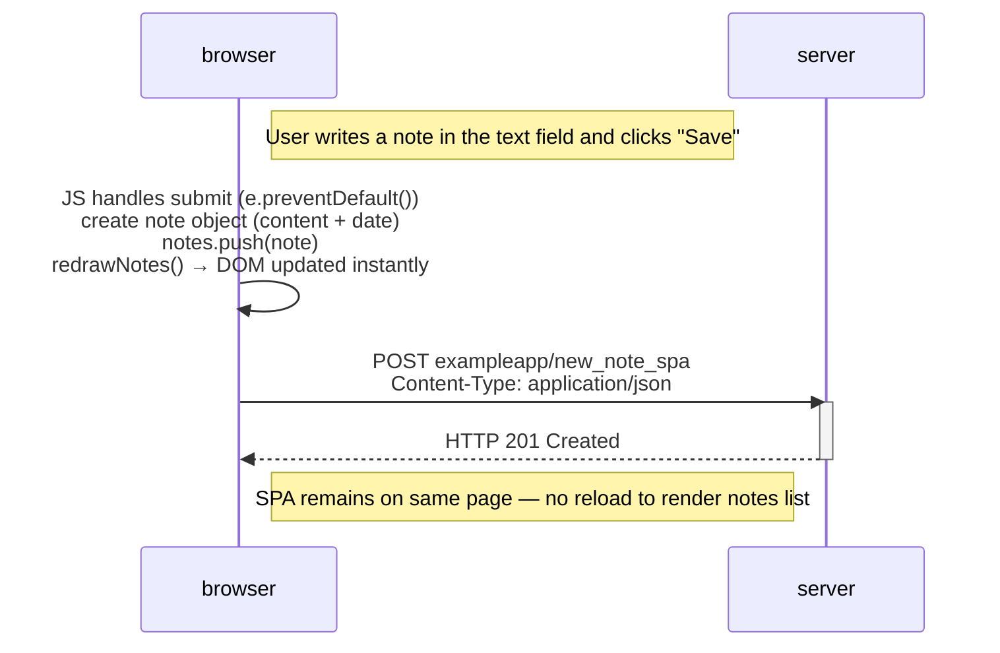

```mermaid
sequenceDiagram
    participant browser
    participant server

    Note right of browser: User writes a note in the text field and clicks "Save"

    browser->>browser: JS handles submit (e.preventDefault())<br>create note object (content + date)<br>notes.push(note)<br>redrawNotes() → DOM updated instantly

    browser->>server: POST exampleapp/new_note_spa<br>Content-Type: application/json
    activate server
    server-->>browser: HTTP 201 Created
    deactivate server

    Note right of browser: SPA remains on same page — no reload to render notes list 
```